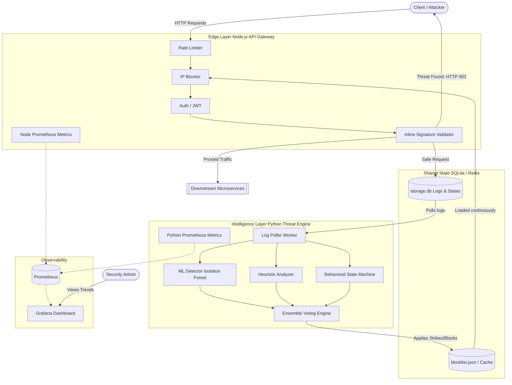

# Architecture & Data Flow

This document outlines the high-level architecture and data flow for **Mitigation of API-based Nuisances using Threat Intelligence System (MANTIS)**.

## High-Level Architecture

MANTIS is composed of two primary asynchronous services communicating through a shared data layer. This separation of concerns allows the API Gateway to remain extremely fast and lightweight, while the Python Detection Engine performs heavy computations (Machine Learning, Heuristics) in the background without impacting API latency.

## Component Breakdown

### 1. Node.js API Gateway (Edge Layer)
Written in Express.js, this layer is designed to be highly concurrent and latency-optimized.
- **Rate Limiter:** Drops volumetric DDoS attacks and brute-force attempts.
- **IP Blocker Middleware:** Checks incoming IPs against `blocklist.json` in memory. Blocks traffic at the TCP/HTTP layer before any processing occurs.
- **Inline Signature Validator:** Evaluates URL parameters, headers, and request bodies against known deterministic signatures (SQLi, XSS, Path Traversal, SSRF, Command Injection). Hard matches result in immediate blocks and are logged as `THREAT_BLOCKED_INLINE`.
- **Logger:** Non-blocking asynchronous writes to `storage.db`.

### 2. Shared Data Layer
- **storage.db (SQLite):** Acts as a highly resilient event-sourcing log for HTTP requests. In distributed environments, this is seamlessly swapped with Redis/Kafka.
- **blocklist.json:** The compiled output of malicious IPs from the Threat Engine.

### 3. Python Threat Detection Engine (Intelligence Layer)
An asynchronous daemon that processes logs offline to identify advanced persistent threats (APTs) and low-and-slow attacks.
- **ML Detector:** Uses `scikit-learn` Isolation Forests to detect volumetric anomalies and outliers in endpoint access frequencies.
- **Heuristic Analyzer:** Analyzes client behavior across time (e.g., triggering multiple warnings, exploring hidden paths, scanning).
- **Behavioral State Machine:** Tracks the lifecycle of a client's session to determine if they are mapping the API.
- **Ensemble Voting:** Collects outputs from all detectors. Applies a severity-weighted scoring system to issue Warn, Throttle, or Block directives.

### 4. Observability Stack
- **Prometheus:** Scrapes `/metrics` from both the Node.js Gateway and Python Engine.
- **Grafana:** Visualizes metrics to track mitigation actions, active threats, blocklist counts, and API health.
