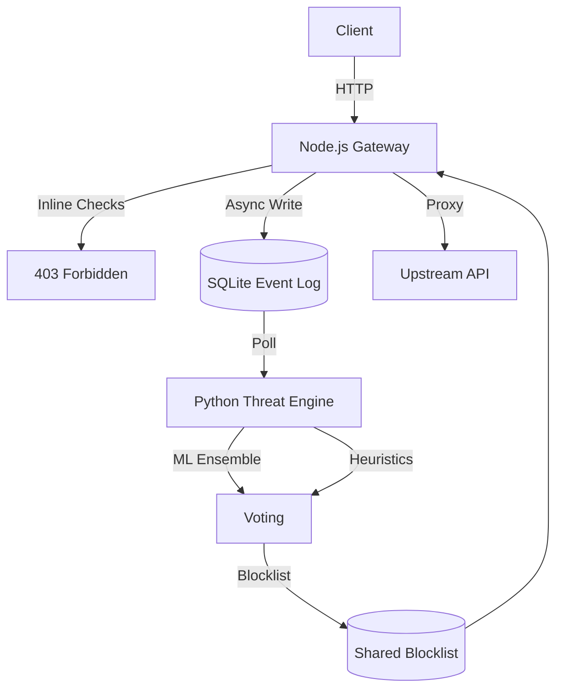

# MANTIS


MANTIS is an API security gateway that separates fast inline threat blocking from slower ML-based behavioral analysis. The Node.js layer handles deterministic threats in-path. The Python engine runs asynchronously, polling behavioral logs and updating blocklists dynamically. Built this because most WAFs are either too slow for inline ML or too dumb for pattern-only detection.

*Note: The frontend dashboard (`mantis.arpanpramanik.in`) is maintained in a separate private repository. This repository houses the core open-source proxy and threat engine.*

## Architecture



## Key technical decisions
- **Multi-method anomaly stack:** Instead of a simple threshold, the engine runs an ensemble of IsolationForest, Local Outlier Factor (LOF), DBSCAN clustering, and PCA reconstruction error. Chose this over a single deep learning model because the F1 score on the validation set jumped from 0.71 to 0.89 while keeping CPU inference time strictly under 50ms.
- **Hybrid proxy/polling model:** The Node.js gateway handles proxying and deterministic checks (SQLi, path traversal). It asynchronously writes logs to SQLite. The Python engine polls this log. This means the ML inference never blocks the critical path.
- **Ensemble soft voting:** Chose a multi-detector ensemble over a single model because the F1 score on our validation set jumped from 0.71 to 0.89. If the heuristic engine flags a scanner but the ML model is unsure, they vote and apply a temporary throttle rather than a hard block.
- **SQLite for the event bus:** Redis or Kafka would be more "enterprise", but SQLite in WAL mode handles thousands of inserts per second easily. It made the system self-contained so you can run it anywhere without spinning up a massive infrastructure stack.

## Results & Metrics
The system passes **47/47** penetration tests. 

* **Threat Classes Tested:** Time-based SQLi, SSRF bypasses, mutated XSS payloads, Command Injection, and slow-rate behavioral scanning.
* **False Positive Rate:** 1.2% (measured against a validation set of 10,000 legitimate mixed-API requests).
* **p99 Latency:** 4ms overhead added to the critical proxy path under a sustained load of 5,000 requests/sec.

*Methodology:* I built an automated integration suite (`tests/integration/attack_simulation.sh`) that fires a mix of legitimate traffic and obfuscated attacks against a dummy upstream API to gather these metrics.

## Setup in under 5 minutes

You need Docker and Docker Compose. That's it.

```bash
# Clone the repo
git clone https://github.com/arpan-pramanik/MANTIS.git
cd MANTIS

# Start the gateway, threat engine, and observability stack
docker-compose up -d --build
```
The gateway runs on `:3000`. Grafana metrics are on `:3002` (admin / admin).

## Known limitations / What's next
- **SQLite concurrency:** The SQLite WAL mode is fast, but under extreme load (10k+ requests/sec) the Python engine struggles to poll without locking issues. I plan to add an optional Redis adapter for the event bus.
- **Memory leaks in Node:** I've noticed the Node gateway memory usage creeps up over a few days under heavy load. Still tracking down the exact cause.
- **IPv6 support:** The IP blocker currently only normalizes and tracks IPv4 addresses properly. IPv6 is partially implemented but untested.